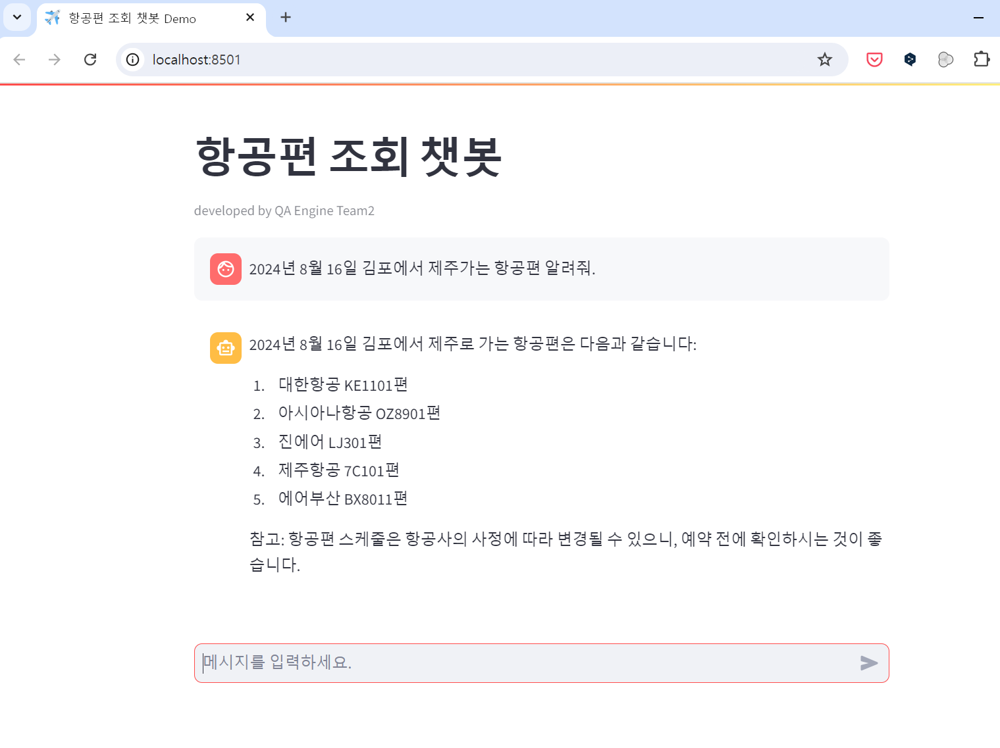

[](https://classroom.github.com/a/yoHXt_g5)
# LangChain QA Engine 2팀
- 실시간 항공운항정보 QA Engine

<br>

## 프로젝트 소개
- 한국공항공사의 실시간 항공운항 현황 정보 상세 조회 서비스와 인천국제공항공사의 여객편 운항현황 서비스를 활용하여 실시간 운항정보 문의 QA 엔진을 구축합니다.
- 사용자는 실시간으로 김포공항과 인천공항의 항공정보를 문의하여 답변을 얻을 수 있습니다.
- 제한사항 : 프로젝트 발표시점으로 인해 실시간 날짜 범주는 며칠부터 며칠까지입니다.
<br>


## Q&A 예시
 ### 1. 항공편 조회
 - 2024년 8월 16일 김포에서 제주가는 항공편 알려줘.
 - 8월 16일 김포에서 제주가는 항공편 중 제일 빨리 가는 항공편이 뭐야?
 - KE1823은 어디에서 어디로 가는 항공편이야?

 ### 2. 출발 예정시간 조회
  - KE1823의 출발예정시간은 언제야?
  - 김포에서 출발해서 제주까지 도착하는 항공편 중에서 제일 빨리 출발하는 것이 뭐야?

 ### 3. 항공사를 통한 조회
  - 이스타항공에서 운영하는 항공편은 어떤게 있어?
  - 2024년 8월 16일 진에어는 어떤 항공편을 운영하지?

 ### 4. 출발지, 도착지를 통한 조회
  - 제주로 도착하는 항공편 알려줘.
  - 제주에서 출발하는 항공편 알려줘.

 ### 5. 시간에 따른 조회
  - 2024년 8월 16일 08시부터 11시 사이에 청주에서 제주로 가는 항공편 알려줘.
  - 7C801 항공편 청주에서 제주까지 가는데 걸리는 시간 알려줘 -> (국내선 한정)


<br>

## 팀원 구성 (ㄱㄴㄷ순)

<div align="center">

| **팀장 주남정** | **팀원 김동규** | **팀원 오승민** | **팀원 한성범** |
| :------: |  :------: | :------: | :------:  |
|[ <br/> @namjeong-joo](https://github.com/namjeong-joo) |[ <br/> @Lumiere001](https://github.com/Lumiere001) |[ <br/> @Pluto-ai](https://github.com/Pluto-ai) |[ <br/> @winterbeom](https://github.com/winterbeom) |
</div>

<br>

## 1. 개발 환경

- 주 언어 : Python v3.12
- 버전 및 이슈관리 : Slack, Github
- 협업 툴 : Slack, Github

<br>

## 2. 채택한 개발 기술과 브랜치 전략

### Langchain

- Langchain
  - RAG를 사용해 실시간 항공운항 현황 정보 지식을 구축하여 LLM으로 질의응답(Q&A) 엔진을 구현합니다.
  - 필터링 조건을 적용하여 특정 항공편, 특정 공항에서 출발 혹은 도착 여부 등의 대한 질문에 대해 답변합니다.


### 외부 API

- 한국공항공사(KAC), 실시간 항공운항 현황 정보 상세 조회 서비스
  - [한국공항공사에서 제공하는 항공기 지연, 결항 등 항공기 상태정보와 항공편 정보를 보다 자세하게 알 수 있는 항공운항정보 상세조회 서비스](https://www.data.go.kr/data/15113771/openapi.do) 이며 국내선 위주의 운항정보가 전달됩니다.
  - 국내선 위주의 운항정보가 전달됩니다.
  - API : https://api.odcloud.kr/api/FlightStatusListDTL/v1/getFlightStatusListDetail  
  - 


- 인천국제공항공사(IIAC), 여객편 운항현황 서비스
  - [인천공항 여객편의 운항현황에 대한 데이터로 항공사, 항공편, 출발/도착 시간 및 공항명, 탑승구 번호와 운항상태 등의 항목을 제공하는 서비스](https://www.data.go.kr/data/15095093/openapi.do) 이며 국내선 위주의 운항정보가 전달됩니다.
  - API : http://api.data.go.kr/B551177/StatusOfPassengerFlightsOdp/getPassengerArrivalsOdp
  - 

- 

### DB scheme
- RAG용으로 저장된 Database Scheme 

  ```sql
  CREATE TABLE `flights` (
    `key_value` int NOT NULL AUTO_INCREMENT,
    `flight_number` varchar(20) NOT NULL COMMENT '운항편 번호',
    `airline` varchar(100) NOT NULL COMMENT '항공사',
    `flight_date` date NOT NULL COMMENT '운항일',
    `STD` time NOT NULL COMMENT '운항 시각',
    `Departure` varchar(100) DEFAULT NULL COMMENT '출발공항',
    `ARRIVAL` varchar(100) DEFAULT NULL COMMENT '도착공항',
    `IO` varchar(10) DEFAULT NULL COMMENT '공항기준 출발 혹은 도착여부',
    PRIMARY KEY (`key_value`)
  ) 
  ```


### 브랜치전략 
    
- 브랜치 전략
  - main, db, dev_api 브랜치로 나누어 개발을 하였습니다.
    - **main** 브랜치는 배포 단계에서만 사용하는 브랜치입니다.
    - **db** 브랜치는 외부 API를 통해 받아온 데이터를 DB에 저장하는 브랜치입니다.
    - **dev_api** 브랜치는 한국공항공사와 인천국제공항공사의 항공편 데이터를 가져오는 브랜치입니다.
    - **llm_handler** 브랜치는 LLM 관련 작업을 처리하는 브랜치입니다.

<br>

## 3. 프로젝트 구조
```
├── README.md
├── .gitignore
├── api_handler.py
├── config.py
├── db_operations.py
├── llm_handler.py
├── main.py
├── rag_retreiver.py
└── resource
     ├── response_json_iiac.png
     └── response_json_kca.png
```

### 모듈 구조
1. `main.py`
   - 주요 설명 : 전체 프로그램의 실행을 제어하는 메인 스크립트입니다.
   - 주요 설명 
      - fetch_and_store_data() : 인천공항 및 김포공항 출발 및 도착 데이터 가져와 DB에 저장
      - initialize_rag() : UpstageEmbedding와 ChatUpstage를 초기화시킴 
      - handle_user_query() : 유저쿼리를 sql문형태로 변환 후 RDB에 해당 user sql문을 조회하여 데이터 반환하여 최종적으로 유저 질의에 답변합니다.
 
2. `api_handler.py`
   - 주요 기능: 한국공항공사와 인천공항공사의 오픈 API와의 통신하여 실시간 운항정보 데이터를 가져옵니다. 

3. `db_operations.py`
   - 주요 기능 : 오픈 API를 통해 받아온 외부 데이터를 DB에 저장 및 조회합니다. 

4. `llm_handler.py`
   - 주요 기능 : OpenAI API를 사용하여 응답 생성, 텍스트를 SQL로 변환, 결과 포맷팅 등 LLM 관련 작업을 수행합니다.

5. `rag_retreiver.py`
   - 주요 기능 : CSV 파일을 읽어와 SQLite3 데이터베이스에 저장한 뒤 쿼리 실행하여 데이터 반환합니다.

### UI 실행 화면





<br>

## 4. 역할 분담 (ㄱㄴㄷ순)

### 팀원 김동규
- **역할**
    - 외부 API를 통해 가져온 데이터를 담을 DB구축 및 저장, main.py에 기능 결합

<br>

### 팀원 오승민
- **역할**
    - DB 구축용 한국공항공사/인천국제공항공사 API 연동
    - Fast API를 활용한 RAG 모델의 API화 작업
    - Streamlit을 활용한 웹페이지 구축

<br>

### 팀원 주남정
- **역할**
    - 코로나 이슈로 코딩 대신 프로젝트 readme 및 문서 작성, 발표 참여

<br>

### 팀원 한성범
- **역할**
    - 유저의 질문을 sql문을 바꾸는 llm 프롬프트 및 모듈 제작
    - 해당 데이터베이스에 유저 sql문을 통해 데이터 조회하는 모듈 제작
    - 유저 질문과 조회된 데이터를 프롬프트 조작에 따라 형식에 맞게 응답 출력하는 모듈 제작

<br>

## 5. 개발 기간 및 작업 관리

### 개발 기간
- 전체 개발 기간 : 2024-08-12 ~ 2024-08-18
- 기능 구현 : 2024-08-12 ~ 2024-08-18

  
<br>


## 5. 프로젝트 후기

### 팀원 김동규
프로젝트 후기 작성

### 팀원 오승민
프로젝트 후기 작성

### 팀원 주남정
프로젝트 후기 작성

### 팀원 한성범
프로젝트 후기 작성

<br>
