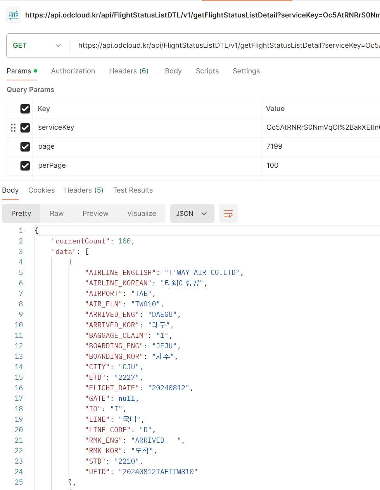
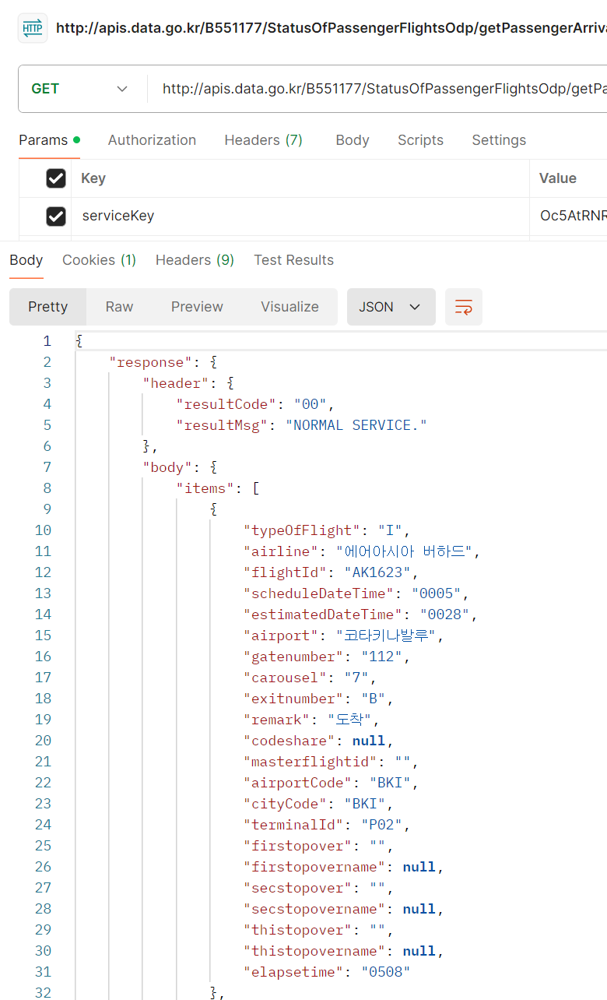

[](https://classroom.github.com/a/yoHXt_g5)
# LangChain QA Engine 2팀
- 실시간 항공운항정보 QA Engine

<br>

## 프로젝트 소개
- 한국공항공사의 실시간 항공운항 현황 정보 상세 조회 서비스와 인천국제공항공사의 여객편 운항현황 서비스를 활용하여 실시간 운항정보 문의 QA 엔진을 구축합니다.
- 사용자는 실시간으로 김포공항과 인천공항의 항공정보를 문의하여 답변을 얻을 수 있습니다.
- 단, 프로젝트 발표시점으로 실시간 날짜 범주는 며칠부터 며칠까지입니다.

<br>

## 팀원 구성 (ㄱㄴㄷ순)

<div align="center">

| **팀장 주남정** | **팀원 김동규** | **팀원 오승민** | **팀원 한성범** |
| :------: |  :------: | :------: | :------:  |
|[ <br/> @namjeong-joo](https://github.com/namjeong-joo) |[ <br/> @Lumiere001](https://github.com/Lumiere001) |[ <br/> @Pluto-ai](https://github.com/Pluto-ai) |[ <br/> @winterbeom](https://github.com/winterbeom) |
</div>

<br>

## 1. 개발 환경

- 주 언어 : Python v3.12
- 버전 및 이슈관리 : Slack, Github
- 협업 툴 : Slack, Github

<br>

## 2. 채택한 개발 기술과 브랜치 전략

### Langchain

- Langchain
  - RAG를 사용해 실시간 항공운항 현황 정보 지식을 구축하여 LLM으로 질의응답(Q&A) 엔진을 구현합니다.
  - 필터링 조건을 적용하여 특정 항공편, 특정 공항에서 출발 혹은 도착 여부 등의 대한 질문에 대해 답변합니다.


### 외부 API

- 한국공항공사(KAC), 실시간 항공운항 현황 정보 상세 조회 서비스
  - https://www.data.go.kr/data/15113771/openapi.do
  - 국내선 위주 
  - 한국공항공사에서 제공하는 항공기 지연, 결항 등 항공기 상태정보와 항공편 정보를 보다 자세하게 알 수 있는 항공운항정보 상세조회 서비스입니다.
  - API : https://api.odcloud.kr/api/FlightStatusListDTL/v1/getFlightStatusListDetail  
  - 


- 인천국제공항공사(IIAC), 여객편 운항현황 서비스
  - https://www.data.go.kr/data/15095093/openapi.do#
  - 국제선 위주
  - 인천공항 여객편의 운항현황에 대한 데이터로 항공사, 항공편, 출발/도착 시간 및 공항명, 탑승구 번호와 운항상태 등의 항목을 제공하는 서비스입니다.
  - API : http://apis.data.go.kr/B551177/StatusOfPassengerFlightsOdp/getPassengerArrivalsOdp
  - 


### 브랜치전략 
    
- 브랜치 전략
  - main, db, dev_api 브랜치로 나누어 개발을 하였습니다.
    - **main** 브랜치는 배포 단계에서만 사용하는 브랜치입니다.
    - **db** 브랜치는 외부 API를 통해 받아온 데이터를 DB에 저장하는 브랜치입니다.
    - **dev_api** 브랜치는 한국공항공사와 인천국제공항공사의 항공편 데이터를 가져오는 브랜치입니다.

<br>

## 3. 프로젝트 구조
```
├── README.md
├── .gitignore
├── api_handler.py
├── config.py
├── db_operations.py
├── main.py
└── resource
     ├── response_json_iiac.png
     └── response_json_kca.png
...

```

<br>

## 4. 역할 분담 (ㄱㄴㄷ순)

### 팀원 김동규
- **역할**
    - 
- **기능**
    - 외부 API를 통해 가져온 데이터를 DB에 저장
<br>

### 팀원 오승민
- **역할**
    - 
- **기능**
    - 외부 API 연동
<br>

### 팀원 주남정
- **역할**
    - 프로젝트 정리
- **기능**
    - 
<br>

### 팀원 한성범
- **역할**
    - 
- **기능**
    - 
<br>

## 5. 개발 기간 및 작업 관리

### 개발 기간
- 전체 개발 기간 : 2024-08-12 ~ 2024-08-19
- 기능 구현 : 2024-08-12 ~ 2024-08-18
- 그외 기간 작성
  
<br>

### 작업 관리
<예시>

- 아래와 같은 오류가 발생했습니다.

```python
C:\Users\yong\AppData\Local\Programs\Python\Python311\Lib\site-packages\langchain_core\_api\deprecation.py:117: LangChainDeprecationWarning: The class `langchain_community.llms.openai.OpenAI` was deprecated in langchain-community 0.0.10 and will be removed in 0.2.0. An updated version of the class exists in the langchain-openai package and should be used instead. To use it run `pip install -U langchain-openai` and import as `from langchain_openai import OpenAI`.
  warn_deprecated(
```

### 설명

- langchain_community.llms.openai.OpenAI는 langchain-community 0.0.10에서 deprecate되었으며 0.2.0에서 제거될 예정입니다.
- 업데이트된 버전의 클래스가 langchain-openai 패키지에 있으며 이것을 사용해야 합니다.


### 해결

- 명령 프롬프트(또는 터미널)에서 다음 명령을 실행해 langchain-openai 패키지를 설치합니다.

```python
pip install -U langchain-openai
```

- 아래와 같이 import문 변경하면 해결됩니다.
```python
from langchain_openai import OpenAI
```


<br>

## 5. 프로젝트 후기

### 팀원 김동규
프로젝트 후기 작성

### 팀원 오승민
프로젝트 후기 작성

### 팀원 주남정
프로젝트 후기 작성

### 팀원 한성범
프로젝트 후기 작성

<br>
